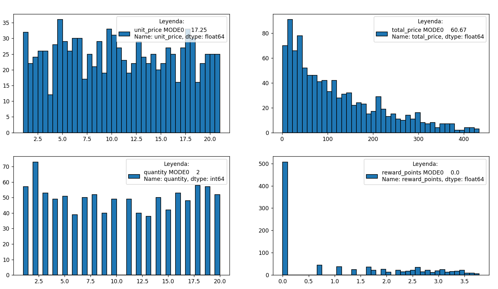
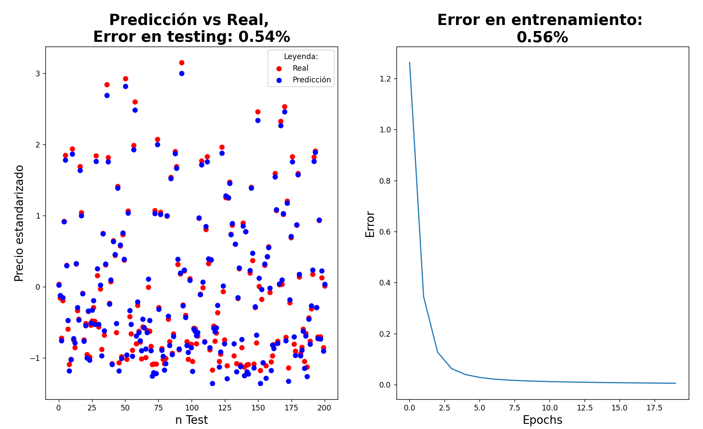

## 📌 Descripción

Este repositorio reúne pequeños proyectos de **Inteligencia Artificial y Machine Learning** desarrollados con diferentes librerías de Python.  
La idea es practicar desde lo básico hasta casos más completos, documentando el proceso y mostrando resultados visuales.

### 🛠️ Librerías utilizadas

- NumPy
- Pandas
- PyTorch
- Matplotlib

## 📂 Proyectos

### 1️⃣ Proyecto básico: **Supermarket** (`./ProyectoBásicoSupermarket`)

#### 📝 Descripción

En este proyecto se implementa una **red neuronal simple (perceptrón multicapa)** con 2 capas _fully connected_ para una tarea de **regresión**:

> Predecir el precio de la cesta de un cliente en un supermercado.

El flujo de trabajo incluye:

1. **Preprocesamiento**:
    - Transformación logarítmica de variables sesgadas.
    - Normalización y codificación de variables categóricas.
    - Estandarización de variables numéricas.
2. **Entrenamiento**:
    - Red neuronal en PyTorch (2 capas).
    - Función de pérdida: MSELoss.
    - Optimizador: SGD.
       
3. **Evaluación y visualización**:
    - Comparación de valores reales vs predichos.
    - Evolución del error de entrenamiento.

#### 📊 Dataset

- Datos tomados de **Kaggle** (_Supermarket sales dataset_).
- Incluye información de sucursales, clientes, productos y precios.

#### 📁 Archivos

- `ScriptDataSuperMarket.py` → Script principal con el pipeline completo.
- `2.DataSuperMarket.csv` → Dataset de entrenamiento y prueba.

#### 🔎 Ejemplo de resultados:

